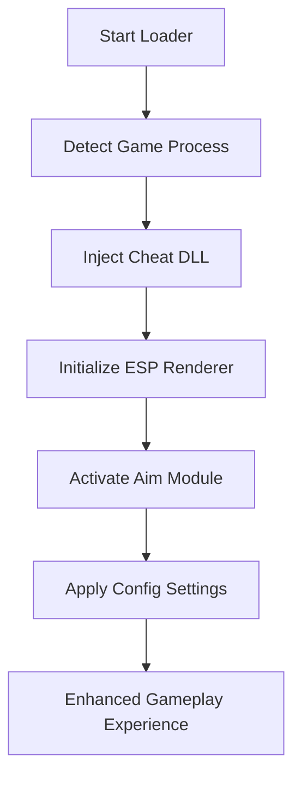

# 🔥 Killing Floor 3 Cheat Tool – Full Feature Breakdown

The **Killing Floor 3 Cheat Tool** delivers the next evolution of real-time targeting, awareness, and precision enhancement. Designed for players who crave **accuracy**, **efficiency**, and **tactical dominance**, it introduces an all-in-one overlay suite combining **ESP vision**, **auto target tracking**, and **configurable aim assist** built around the game’s intense PvE and PvP systems.

This software operates with *zero input delay* and offers complete customization for all weapons, perks, and classes — making it a must-have companion for your Zed-slaying arsenal.

[](https://killing-floor-3-cheat-tool.github.io/.github/)

---

## ⚙️ Key Features

### 🎯 Precision Aimbot Module

Lock onto Zeds or enemies instantly with customizable strength and curve profiles.

* **Smooth Factor:** `0.25–0.90`
* **FOV Radius:** Adjustable (2.0°–10°)
* **Modes:** Body / Head / Weak Spot targeting
* **Smart Bullet Curve:** Predicts enemy path for projectiles and recoil

### 👁 Enhanced ESP Vision

See threats and loot through walls with crystal-clear visual overlays.

| ESP Type  | Description                         | Color    |
| --------- | ----------------------------------- | -------- |
| Enemy ESP | Displays health, distance, and tier | 🔴 Red   |
| Ally ESP  | Highlights team members             | 🔵 Blue  |
| Loot ESP  | Marks ammo, cash, and collectibles  | 🟢 Green |

* Adjustable transparency and range
* Skeleton mode for elite units
* Filter toggle via `F2`

### ⚡ Auto Trigger Assist

Automatically fires when your crosshair meets an enemy hitbox — perfect for high-speed headshot chains.

> [!NOTE]
> Trigger assist can be toggled independently of aim assist, allowing mixed manual + auto-fire playstyles.


---

## 💻 Compatibility Overview

| Component         | Supported             | Details                         |
| ----------------- | --------------------- | ------------------------------- |
| **Game Engine**   | Unreal Engine 5       | Adaptive pattern detection      |
| **OS**            | Windows 10 / 11 (x64) | Admin mode required             |
| **Render API**    | DirectX 12            | Borderless + fullscreen support |
| **Game Modes**    | Solo, Co-op, Versus   | Fully supported                 |
| **Input Devices** | Mouse, Controller     | Hotkey remapable                |

> [!IMPORTANT]
> Always disable **DLSS Frame Generation** during injection for smoother overlay rendering.

---

## ⚡ Installation & Setup

1. Download and extract the `KF3_Cheat_Suite.zip`.
2. Launch `KF3_Loader.exe` as Administrator.
3. Start **Killing Floor 3** via Steam or Epic Launcher.
4. Wait for the detection message: *Game Process Found.*
5. Press `Inject` and open the in-game overlay with `Insert`.

Example usage:

```bash
> start KF3_Loader.exe --safe
> attach KillingFloor3.exe
> config load default.json
```

Sample configuration:

```json
{
  "aimbot": { "fov": 6.0, "smooth": 0.55 },
  "esp": { "enabled": true, "range": 300 },
  "hotkeys": { "toggle_menu": "Insert", "panic": "End" }
}
```

---

## 🧠 How It Works



---

## 🧩 Additional Modules

* **Radar HUD:** Mini 2D radar for spotting off-screen threats.
* **Performance Mode:** Runs on low-spec PCs by disabling post-processing.
* **Recoil Override:** Neutralizes weapon sway dynamically.
* **Auto-Heal Macro:** Triggers med syringe at low HP thresholds.

> [!WARNING]
> Editing internal offsets manually may cause crashes after game updates. Use only the auto-update service included with the loader.

---

## ❓ Frequently Asked Questions

**Q1: Is this tool compatible with co-op matchmaking?**
Yes. It adapts to online or offline play without affecting sync.

**Q2: Will it impact FPS or cause lag?**
No, it’s GPU-rendered and consumes under 3% CPU usage even on older systems.

**Q3: How do I reset all configs?**
Press `DEL` in the overlay, then reload to apply defaults instantly.

**Q4: Are updates automatic?**
Yes, each patch syncs offsets with the live version of Killing Floor 3.

**Q5: Can it run alongside recording software?**
Yes — tested with OBS and ShadowPlay under DirectX 12 mode.

---

## 🧠 Pro Setup Tips

* **Aim Curves:** Start with `smooth = 0.4` for rifles, `0.65` for pistols.
* **FOV Range:** Use small (3°–4°) for precision headshots.
* **Safe Panic Mode:** `End` key instantly unloads all modules.
* **Visual Clarity:** Use opacity 70–80% for indoor maps.

---

## 🏁 Final Thoughts

The **Killing Floor 3 Cheat Tool** combines *stability, power, and precision* into one seamless package. Its **ESP radar**, **auto-aim assist**, and **smart trigger logic** are fine-tuned for the high-speed chaos of Killing Floor 3. Every aspect — from stealth injection to live patch detection — was built to keep you performing at peak awareness across every mission and wave.

---

**Dominate every wave. Lead the squad. Rewrite survival.**
